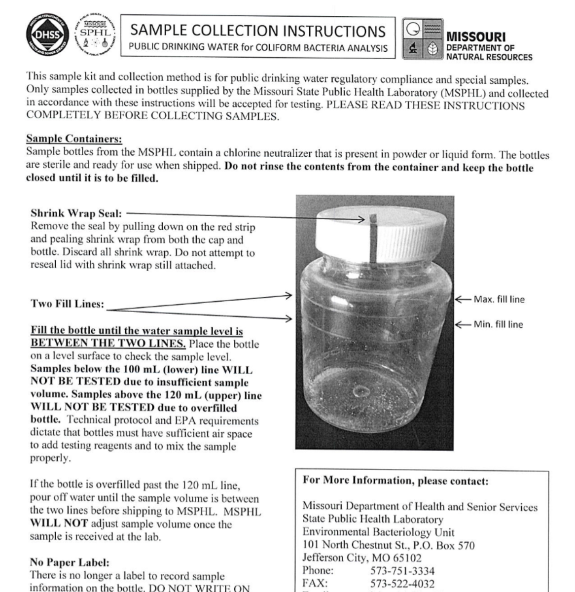
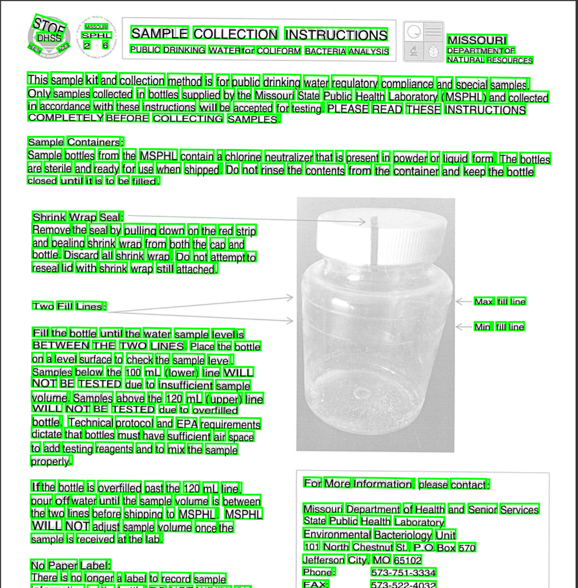

# ocr-pdf-via-document-ai

Takes a set of jpg files, runs OCR on them via Google Cloud Document AI and outputs

- A plain text file per input image
- The raw docai JSON output
- A HOCR file per input image (can be opened as a standalone HTML file via hocrjs)
- A PDF file with an invisible text layer to make it searchable

Example:

| Input Image             | Debug Output             |
| ----------------------- | ------------------------ |
|  |  |

## Why a cloud service?

Tesseract is the best open-source OCR engine, but sadly the Google Service performs much better and has the following extra features:

- Supports any number of languages mixed together (also outputs per-line language confidence scores)
- Detects and corrects any page orientation
- High recognition accuracy with different fonts and even handwriting
- In theory the option for advanced capabilities such as table extraction / form extraction

### Cost

Currently the price is $1.5 per 1000 pages (see [here](https://cloud.google.com/document-ai/pricing)).

# Installation and Running

You'll need to set up the following env variables:

- GOOGLE_APPLICATION_CREDENTIALS: (only if you don't have default credentials) path to a json file giving access to Document AI
- API_ENDPOINT: e.g. `eu-documentai.googleapis.com`
- PROCESSOR_NAME: something like `projects/00000000000/locations/eu/processors/fffffffffffff`

Then run:

```
yarn install
```

```
yarn run ocr --writePdf out.pdf --writeTxt --input input_dir/*.jpg
```

The aw document-ai output is always written so if you run it again it will only do API calls for new files.

## TODO

- Package as npm package, fix startup time
- Ensure PDF output has all the text in the "correct" order when run through `pdftotext`
